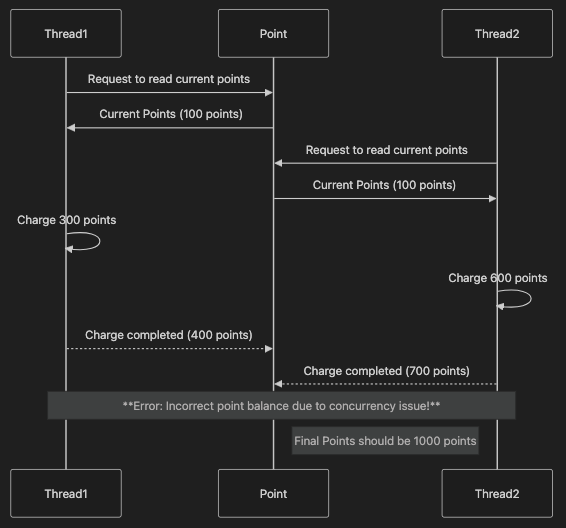
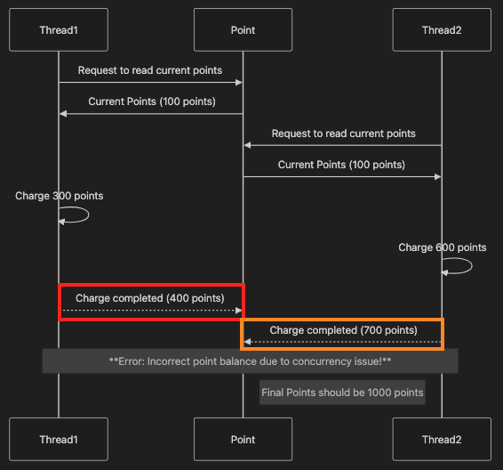
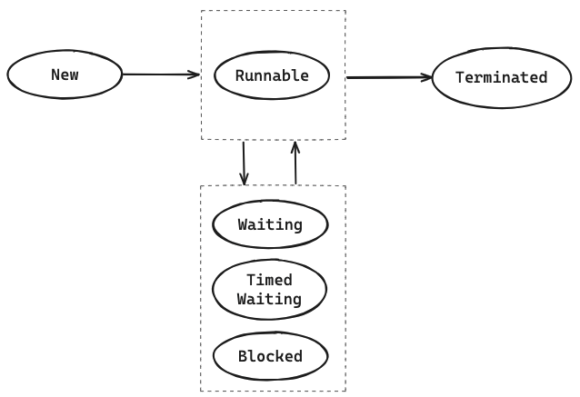

# 동시성 제어 방식에 대한 분석 및 보고서

## 요구사항 분석

> 동시에 여러 건의 포인트 충전, 이용 요청이 들어올 경우 순차적으로 처리되어야 합니다.

### 요구사항을 만족하지 않은 경우 어떤 일이 발생할까 🤔

**Case 1) A유저 300 포인트 충전 요청, A유저 600 포인트 충전 요청**

`동일 유저` 에 대한 포인트 충전 요청이 동시에 들어오는 경우, 적절히 동시성 제어가 되지 않으면 충전 결과가 기대한 것과 다른 상태를 가질 수 있다.



동일 유저에 대한 충전 요청이 각각 순차적으로 처리되었으면, 최종적으로 1000 포인트를 기대하지만 동시성 이슈로 인해 최종적으로 700 포인트가 기록되는 (300 포인트 소실 🥲) 문제 상황이 발생할 수 있다. 

(FYI. 포인트 사용의 케이스도 마찬가지로 동시성 이슈로 가용 포인트보다 더 많은 포인트를 사용하게 만드는 오류가 있을 수 있다)

**Case 2) A유저 포인트 충전 요청, B유저 포인트 충전 요청**

`서로 다른 유저` 에 대한 포인트 충전 요청이 동시에 들어오는 경우는 동시성 제어 없이도 Case 1 에서 발생한 동시성 문제가 발생하지 않기 때문에 두 요청을 반드시 순차적으로 처리할 필요가 없다.

### 요구사항 해석

동시성 제어를 하지 않았을 때 발생하는 문제를 바탕으로 요구사항을 다음과 같이 해석할 수 있다.

>- 동시에 같은 유저에 대한 여러 건의 포인트 충전 또는 이용 요청은 순차적으로 처리되어야 합니다. (최소 조건)
>- 동시에 서로 다른 유저에 대한 여러 건의 포인트 충전 또는 이용 요청은 동시적으로 처리되어도 된다. (옵션)

서로 다른 유저에 대한 동시 요청에 대해서는 “동시적으로 처리되어도 된다” 라고 표현한 이유는 이 부분을 만족하지 않아도 요구사항의 최소 조건을 충족하기 때문이다. (성능 관점에서 옵션으로 가져갈 수 있는 부분)

---

## 동시성 제어

### 동시성 제어를 어디에 적용할까 (Service? Repository?) 🤔

Repository 계층에서의 동시성 제어를 적용하기 위해 다음과 같이 `Thread-safe` 하지 않은 것들을 리팩터링 대상으로 정리했다.

- `UserPointTable` 
  - HashMap를 동시성 처리를 지원하는 자료구조로 변경   
- `PointHistoryTable`
  - ArrayList를 동시성 처리를 지원하는 자료구조로 변경
  - Mutable 필드인 cursor에 동기화 처리

하지만 위 내용을 모두 해결한다고 해도, Repository 계층에서만 동시성 제어를 하는 것은 한계가 있다고 판단했다. 

```java
public class UserPointTable {

    private final Map<Long, UserPoint> table = new HashMap<>();

    public UserPoint selectById(Long id) {
        throttle(200);
        return table.getOrDefault(id, UserPoint.empty(id));
    }

    public UserPoint insertOrUpdate(long id, long amount) {
        throttle(300);
        UserPoint userPoint = new UserPoint(id, amount, System.currentTimeMillis());
        table.put(id, userPoint);
        return userPoint;
    }
}
```

`UserPointTable`의 `insertOrUpdate` 메서드를 보면 업데이트할 포인트를 인자(amount)로 넘겨받는다. 만약 `table` 구현체가 `ConcurrentHashMap`으로 변경되어서 동일한 유저 ID에 대한 포인트 업데이트가 순차적으로 처리되더라도 전달받은 인자 값 자체가 잘못될 경우 문제가 발생할 수 있는 구조를 가진다. 



예를 들어서, 빨간색 요청(400 포인트로 업데이트), 주황색 요청(700 포인트로 업데이트)이 ConcurrentHashMap에서 순차적으로 처리되더라도, 현재 포인트 값의 기대값인 1000 포인트를 가지지 못한 문제는 여전히 발생한다. Service 계층에서 동시성 제어가 처리되어야 하는 이유이기도 하다.   

### Service 계층에서의 동시성 제어 방식

#### Synchronized

```java
public synchronized PointResponse chargePoints(long userId, PointRequest pointRequest) {
    UserPoint currentUserPoint = pointRepository.selectById(userId);
    long afterChargePoint = currentUserPoint.point() + pointRequest.amount();
    
    if (afterChargePoint > UserPoint.MAX_BALANCE) {
      throw new MaxBalanceExceededException();
    }
    UserPoint userPoint = pointRepository.insertOrUpdate(userId, afterChargePoint);
    pointHistoryRepository.insert(userId, pointRequest.amount(), TransactionType.CHARGE, System.currentTimeMillis());
    
    return pointMapper.mapToPointResponse(userPoint); 
}

public synchronized PointResponse usePoints(long userId, PointRequest pointRequest) {
    UserPoint currentUserPoint = pointRepository.selectById(userId);
    
    if (currentUserPoint.point() < pointRequest.amount()) {
      throw new InsufficientPointException();
    }
    UserPoint userPoint = pointRepository.insertOrUpdate(userId, currentUserPoint.point() - pointRequest.amount());
    pointHistoryRepository.insert(userId, pointRequest.amount(), TransactionType.USE, System.currentTimeMillis());
    
    return pointMapper.mapToPointResponse(userPoint);
}
```

가장 먼저 시도 했던 동시성 제어 방식은 `synchronized` 이었다. 이 키워드를 사용하면 한 번에 하나의 스레드만 실행할 수 있는 임계 구역(Critical Section)을 만들 수 있다.
Java Object는 내부에 락(Lock)을 가지고 있는데, 이를 모니터 락이라고도 부른다. `synchronized` 키워드가 사용된 메서드에 진입하기 위해서는 반드시 락을 확보해야 하고, 락을 확보하지 못한 스레드의 경우 대기 상태에 있다가 락을 확보하는 시점에 해당 메서드에 진입하는 식으로 동작한다.



임계 구역에 진입하기 전에 락 확보할 때 까지 대기하는 경우, 해당 스레드는 `BLOCKED` 상태에 놓이는데, 락을 점유하고 있는 스레드가 락을 해제할 때까지 무한정 대기하는 특징을 가진다. 

`synchronized` 키워드를 통해 동시성 제어를 하게 되는 경우 요구사항의 최소 조건을 만족한다. 다만 락을 확보할 때까지 무한정 대기하는 특징은 앞으로 서비스가 고도화됨에 따라 유저의 경험을 나쁘게 만들 수 있는 요인이 될 수 있다는 점에 한계가 있다고 생각했다.
예를 들어, 포인트 충전, 이용 요청이 상당히 많이 들어와서 처리에 시간이 오래 걸리는 경우 유저는 요청 처리 상태에서 계속 대기하게 된다. 이 경우에는 오히려 "나중에 다시 시도해주세요." 라는 메시지를 응답하는 것이 유저로 하여금 더 나은 경험을 만들어 줄 것이다.

#### Reentrant Lock

```java

private final ReentrantLock lock = new ReentrantLock();

public PointResponse chargePoints(long userId, PointRequest pointRequest) {
    lock.lock();
    try {
        // synchronized 동시성 제어 시 임계 구역 코드와 동일
    } finally {
        lock.unlock();
    }
}

public synchronized PointResponse usePoints(long userId, PointRequest pointRequest) {
    lock.lock();
    try {
        // synchronized 동시성 제어 시 임계 구역 코드와 동일
    } finally {
        lock.unlock();
    }
}
```

`ReentrantLock`은 자바 1.5부터 지원한 `Lock`(java.util.concurrent.locks) 인터페이스 구현체다. 여러 다른 차이점이 있지만 특히 앞서 `synchronized` 키워드에서 언급한 락 확보할 때까지 무한 대기하는 문제를 해결할 수 있다. 

```java
boolean tryLock(); // 락 확보 시도, 즉시 성공 여부 반환 

boolean tryLock(long time, TimeUnit unit) throws InterruptedException; // 주어진 시간 동안만 락 확보 시도, 성공 여부 반환 
```

`synchronized` 방식과 달리, 위 두 메서드를 활용해서 처리 시간이 일정 기준을 초과하는 경우 유저에게 처리 실패 상황을 응답함으로써 유저 경험을 더 높일 수 있다는 점에서 우선 더 활용 가치가 높다고 생각했다. 다만 실제 통합 테스트를 통해 동시성 테스트를 했을 때 소요되는 시간이 거의 동일해서 성능 관점에서의 이점은 아니었다.
요구사항 관점에서 봤을 때도 `ReentrantLock`을 활용한 동시성 제어 방식 역시 최소 조건만 만족한다. 

#### Reentrant Lock + ConcurrentHashMap 

>- 동시에 같은 유저에 대한 여러 건의 포인트 충전 또는 이용 요청은 순차적으로 처리되어야 합니다. (최소 조건)
>- 동시에 서로 다른 유저에 대한 여러 건의 포인트 충전 또는 이용 요청은 동시적으로 처리되어도 된다. (옵션)

`synchronized`, `ReentrantLock` 이 두 방식은 최소 조건은 만족하는데, 서로 다른 유저에 대한 여러 건의 포인트 충전, 이용 요청도 불필요하게 순차적으로 처리하므로 이 부분을 해결해보고 싶었다.
앞서 Repository 계층에서 동시성 제어 방식 도입 (ConcurrentHashMap) 하는 부분에서 힌트를 얻어서 위 두 조합으로 문제를 풀어보게 됐다. 결과적으로 유저 ID 별로 락을 생성 및 관리해야 한다.

```java
private final Map<Long, Lock> locks = new ConcurrentHashMap<>();

public PointResponse chargePoints(long userId, PointRequest pointRequest) {
    Lock lock = getLockForUser(userId);
  
    lock.lock();
    try {
        // synchronized 동시성 제어 시 임계 구역 코드와 동일 
    } finally {
      lock.unlock();
    }
}

public synchronized PointResponse usePoints(long userId, PointRequest pointRequest) {
    Lock lock = getLockForUser(userId);
  
    lock.lock();
    try {
        // synchronized 동시성 제어 시 임계 구역 코드와 동일 
    } finally {
      lock.unlock();
    }
}

private Lock getLockForUser(long userId) {
    return locks.computeIfAbsent(userId, user -> new ReentrantLock());
}
```

위와 같이 구현사항을 변경했을 때 서로 다른 유저에 대한 포인트 충전, 이용 요청이 동시에 처리되면서 `ReentrantLock` 버전에서 약 11초 정도 걸렸던 테스트가 `ReentrantLock + ConcurrentHashMap` 버전에서 약 3초로, 약 8초 가량 줄어들었다 🎉 (아래 테스트 코드 참고) 

<details>
<summary>테스트 코드</summary>

테스트 세팅: 10명의 유저가 두 번의 충전 요청을 하는 경우 & 10개의 기본 스레드

```java
@Test
public void 포인트_충전_동시성_테스트() throws InterruptedException {
    // given
    int userCount = 10;
    int requestCount = 2;
    long pointToCharge = 100L;
    PointRequest request = new PointRequest(pointToCharge);
  
    ExecutorService executorService = Executors.newFixedThreadPool(userCount);
    CountDownLatch countDownLatch = new CountDownLatch(userCount * requestCount);
  
    // when
    for (long userId = 1; userId <= userCount; userId++) {
      long currentUserId = userId;
  
      Runnable chargeTask = () -> {
        try {
          pointService.chargePoints(currentUserId, request);
        } finally {
          countDownLatch.countDown();
        }
      };
  
      executorService.submit(chargeTask);
      executorService.submit(chargeTask);
    }
  
    countDownLatch.await();
    executorService.shutdown();
  
    // then
    for (long userId = 1; userId <= userCount; userId++) {
      PointResponse response = pointService.getPointsByUserId(userId);
      assertThat(response.userId()).isEqualTo(userId);
      assertThat(response.point()).isEqualTo(pointToCharge * requestCount);
    }
}
```
</details>

처음 요구사항을 분석하면서 예상했던 것과 같이 성능상에 이점을 볼 수 있었다. 하지만 다음과 같은 의문이 들었다. 

> 우리 서비스를 이용하는 유저 수가 많아진다면...?  

사실 현재 구조에서는 DB 구현체가 애플리케이션 메모리 기반으로 되어 있어서 지금 당장 이 부분을 급하게 수정할 필요까지는 없다고 판단했다. 하지만 DB 구현체를 영속성을 지원하는 RDB 등으로 교체될 때 등 임계점이 넘어가는 시점에는 잠재적인 문제가 실제 (메모리 이슈 등) 문제로 발전할 수 있다고 생각했다.
당장 떠오로는 대안으로는 일정 시간 동안 요청이 없는 유저에 대해서는 더 이상 관리하지 않도록 처리하거나 아니면 `Redis`를 이용해서 TTL, 영속성을 지원받아 사용자가 늘어났을 때를 대비할 수 있을 것 같다. 이 부분은 추가로 더 정리해보려고 한다 🧐 


